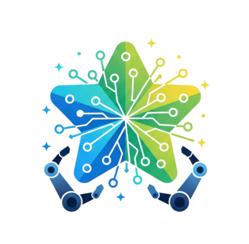

<div align="center">



# Microsoft Rewards Bot

**Automate your Microsoft Rewards points collection**

[](https://discord.gg/k5uHkx9mne) 
[](https://github.com/Obsidian-wtf/Microsoft-Rewards-Bot)
[](https://github.com/Obsidian-wtf/Microsoft-Rewards-Bot/releases)

</div>

---

## 💡 What is this?

A **TypeScript bot** that automatically earns Microsoft Rewards points by completing:

- 🔍 Desktop & mobile Bing searches
- 📋 Daily quizzes, polls, and activities  
- 🎁 Promotional offers and punch cards
- 📚 Read-to-earn tasks

**Built with anti-detection** to work safely and reliably.

---

## ✨ Features

- 🤖 **Human-like behavior** — Natural search patterns
- ⏰ **Auto-scheduling** — Set it and forget it
- � **Multi-account support** — Manage multiple accounts
- 🔔 **Notifications** — Discord webhooks & mobile alerts
- 🐳 **Docker ready** — Easy containerized deployment
- 🌐 **Proxy support** — Enhanced privacy (optional)

---

## 🚀 Quick Start

### Prerequisites

- **Node.js 20+** (v22 recommended) — [Download](https://nodejs.org/)
- **Microsoft account(s)** with email + password

### Installation

```bash
# 1. Download the project
git clone https://github.com/Obsidian-wtf/Microsoft-Rewards-Bot.git
cd Microsoft-Rewards-Bot

# 2. Install dependencies
npm install

# 3. Setup and run
npm run setup
```

**That's it!** The wizard will guide you through account setup and start earning points.

### 📖 Need Help?

**First time using the bot?** → [📘 Getting Started Guide](docs/getting-started.md)

The complete guide covers:
- ✅ Detailed installation steps
- ✅ Creating Microsoft accounts with referrals (+7,500 points/month!)
- ✅ Setting up 2FA authentication
- ✅ Configuration options
- ✅ Troubleshooting common issues

---

## 📚 Documentation

**New to the bot?** Start here: **[📘 Getting Started Guide](docs/getting-started.md)**

**Need specific info?** Check the **[📖 Documentation Hub](docs/index.md)**

<details>
<summary><strong>📑 Quick Links</strong></summary>

| Guide | Description |
|-------|-------------|
| **[Getting Started](docs/getting-started.md)** | Complete installation tutorial |
| **[Accounts & 2FA](docs/accounts.md)** | Setup accounts with authentication |
| **[Configuration](docs/config.md)** | Customize bot behavior |
| **[Scheduling](docs/schedule.md)** | Automate with cron/Task Scheduler |
| **[Notifications](docs/notifications.md)** | Discord & mobile alerts |
| **[Troubleshooting](docs/troubleshooting.md)** | Fix common issues |

</details>

---

## 📊 Dashboard (BETA)

Monitor and control your bot through a local web interface:

```bash
# Start dashboard separately
npm run dashboard

# Or enable auto-start in config.jsonc:
{
  "dashboard": {
    "enabled": true,
    "port": 3000
  }
}
```

Access at `http://localhost:3000` to:
- 📈 View real-time points and account status
- 📋 Monitor live logs with WebSocket streaming
- 🔄 Manually sync individual accounts
- ⚙️ Edit configuration with automatic backup
- 📊 View historical run summaries and metrics

**[📖 Full Dashboard API Documentation](src/dashboard/README.md)**

---

## 🆕 Account Creator (BETA)

Automatically create new Microsoft accounts with advanced security features:

```bash
# Interactive mode (asks everything)
npm run creator

# With specific recovery email (auto-detected, no flag needed!)
npm run creator https://rewards.bing.com/welcome?rh=YOUR_CODE -y backup@gmail.com

```

**✨ Features:**
- 🎯 **Language-independent** — Works in any language
- 🔐 **Strong passwords** — Automatically generated (12-16 chars)
- 📧 **Realistic emails** — 200+ name database for natural-looking addresses
- 🎂 **Natural birthdates** — Random age 18-50 years old
- 🛡️ **Recovery email** — Optional backup email for account recovery
- 🔒 **2FA support** — TOTP authentication with Google Authenticator
- 🔑 **TOTP secrets** — Extracts and saves secret keys
- 💾 **Complete backups** — Saves all details including recovery codes
- 🤖 **CAPTCHA support** — Manual solving (human verification)
- � **Organized storage** — Individual files per account

**🎛️ Command Arguments (SIMPLIFIED!):**
- `<url>` — Referral URL (auto-detected if starts with http)
- `<email>` — Recovery email (auto-detected if contains @)
- `-y` — Auto-accept mode (enables recovery + 2FA automatically)

**That's it! No more confusing flags.** 🎉

**⚙️ How It Works:**

| Command | Recovery Email | 2FA | Notes |
|---------|---------------|-----|-------|
| `npm run creator` | ❓ Prompts | ❓ Prompts | Interactive mode |
| `npm run creator -y` | ✅ Prompts for email | ✅ Enabled | Auto-accept all |
| `npm run creator -y backup@gmail.com` | ✅ Uses provided email | ✅ Enabled | Full automation |
| `npm run creator URL -y` | ✅ Prompts for email | ✅ Enabled | With referral |
| `npm run creator URL -y backup@gmail.com` | ✅ Uses provided email | ✅ Enabled | Complete setup |

**📋 What happens:**
1. Creates Microsoft account (email, password, birthdate, names)
2. Enrolls in Microsoft Rewards (if referral URL provided)
3. **[Optional]** Adds recovery email with verification
4. **[Optional]** Sets up 2FA with TOTP (Google Authenticator compatible)
5. Extracts and saves TOTP secret key and recovery code
6. Saves complete account info to `accounts-created/` directory

**🔐 Saved Information:**
- Email and password
- Full name and birthdate
- Referral URL (if used)
- Recovery email (if added)
- TOTP secret key (for authenticator apps)
- 5-part recovery code (emergency access)

**[📖 Full Account Creator Guide](src/account-creation/README.md)**

---

## ⏰ Automatic Scheduling

Configure automatic task scheduling directly from `config.jsonc` - **perfect for Raspberry Pi!**

```jsonc
{
  "scheduling": {
    "enabled": true,    // Just set this to true
    "type": "auto",     // Automatically detects Windows/Linux/Raspberry Pi
    "cron": {
      "schedule": "0 9 * * *"  // Raspberry Pi/Linux: Daily at 9 AM
    },
    "taskScheduler": {
      "schedule": "09:00"      // Windows: Daily at 9:00
    }
  }
}
```

**Then simply run:**
```bash
npm start
```

The bot will automatically configure cron (Linux/Raspberry Pi) or Task Scheduler (Windows) for you!

**[📖 Full Scheduling Documentation](docs/schedule.md)**

---

## 🐳 Docker Quick Start

For containerized deployment with built-in scheduling:

```bash
# Ensure accounts.jsonc and config.jsonc exist in src/
docker compose up -d

# View logs
docker logs -f microsoft-rewards-script

# Check status
docker compose ps
```

Container includes:
- ✅ Built-in cron scheduling
- ✅ Automatic timezone handling
- ✅ Random execution delays (anti-detection)
- ✅ Health checks

**📖 [Full Docker Guide](docs/docker.md)**

---

## ⚙️ Configuration Highlights

The script works great with default settings, but you can customize everything in `src/config.jsonc`:

```jsonc
{
  "search": {
    "useLocalQueries": false,     // Prioritize Google Trends API (recommended)
    "settings": {
      "useGeoLocaleQueries": true // Use account country for searches (FR, DE, JP, etc.)
    }
  },
  "queryDiversity": {
    "enabled": true,              // Mix multiple search sources
    "sources": ["google-trends", "reddit", "local-fallback"]
  },
  "humanization": {
    "enabled": true,              // Enable natural behavior patterns
    "stopOnBan": true             // Stop on ban detection
  },
  "workers": {
    "doDesktopSearch": true,      // Desktop Bing searches
    "doMobileSearch": true,       // Mobile Bing searches
    "doDailySet": true,           // Daily tasks and quizzes
    "doMorePromotions": true,     // Promotional offers
    "doPunchCards": true          // Multi-day challenges
  },
  "execution": {
    "clusters": 1,                // Parallel account processing
    "runOnZeroPoints": false      // Skip when no points available
  }
}
```

**📖 [Complete Configuration Guide](docs/config.md)**

---

## 🎯 What Gets Automated

The script automatically completes:

- ✅ **Desktop Searches** — 30+ searches on Bing (desktop user-agent)
- ✅ **Mobile Searches** — 20+ searches on Bing (mobile user-agent)
- ✅ **Daily Set** — Quizzes, polls, and daily activities
- ✅ **More Activities** — Promotional tasks and special offers
- ✅ **Punch Cards** — Multi-day challenges and bonus tasks
- ✅ **Daily Check-in** — Simple check-in for bonus points
- ✅ **Read to Earn** — Article reading tasks

All while maintaining **natural behavior patterns** to minimize detection risk.

---

## 💡 Usage Tips

- **Run regularly:** Use cron, systemd timers, or Windows Task Scheduler (see docs)
- **Use humanization:** Always keep `humanization.enabled: true` for safety
- **Monitor logs:** Check for ban warnings and adjust settings if needed
- **Multiple accounts:** Use the `clusters` setting to run accounts in parallel
- **Start small:** Test with one account before scaling up
- **Capture logs:** Pipe output to a file or webhook for later review

---

## ✅ Tests

- `npm run test`: runs the node:test suite with ts-node to validate critical utilities.

---

## 🆘 Need Help?

- 💬 **[Discord Community](https://discord.gg/k5uHkx9mne)** — Get support & updates
- 📖 **[Documentation](docs/index.md)** — Complete guides
- 🐛 **[Report Bug](https://github.com/Obsidian-wtf/Microsoft-Rewards-Bot/issues)** — Found an issue?
- � **[Troubleshooting](docs/troubleshooting.md)** — Fix common problems

---

## ⚠️ Disclaimer

This bot automates Microsoft Rewards interactions, which **may violate their Terms of Service**.

**Risks:**
- ⚠️ Account suspension or ban
- 🚫 Loss of points and rewards

**Educational purposes only.** Use at your own risk.

---

## 📄 License

**CC BY-NC-SA 4.0** — Personal use only, no commercial use.

See [LICENSE](LICENSE) for details.

---

<div align="center">

**⭐ Star the repo** • **💬 [Join Discord](https://discord.gg/k5uHkx9mne)** • **� [Documentation](docs/index.md)**

Made with ❤️ by the community

</div>
